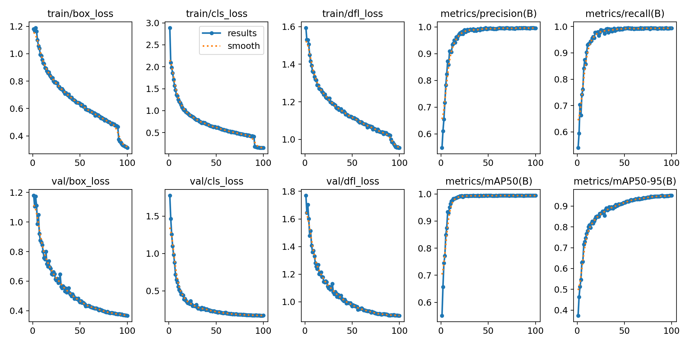
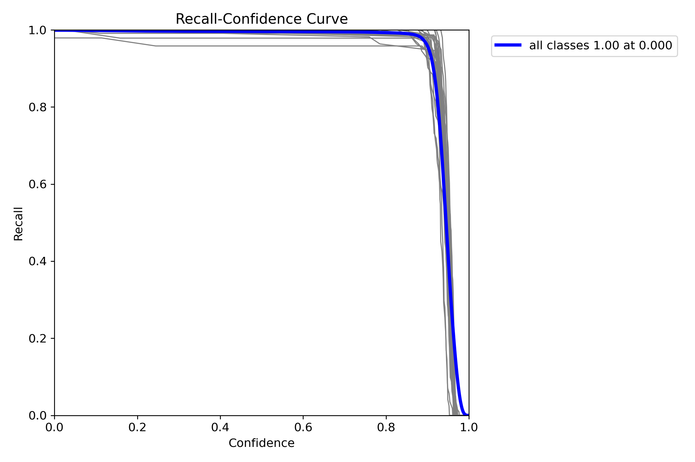
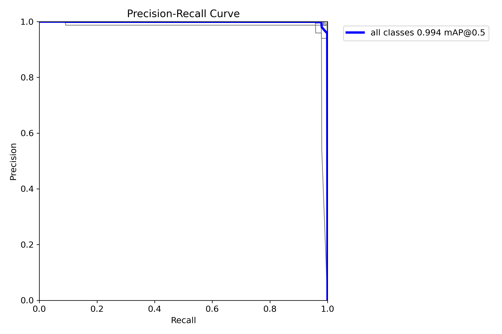
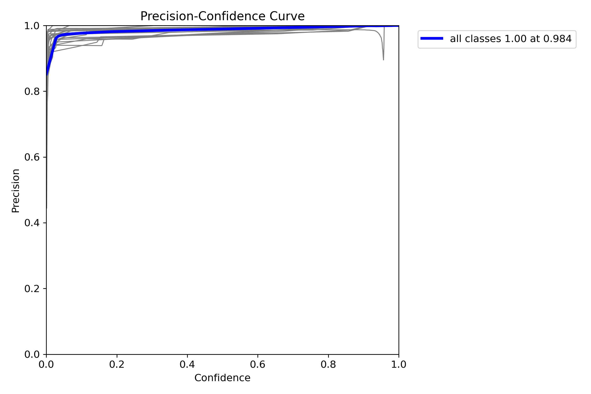
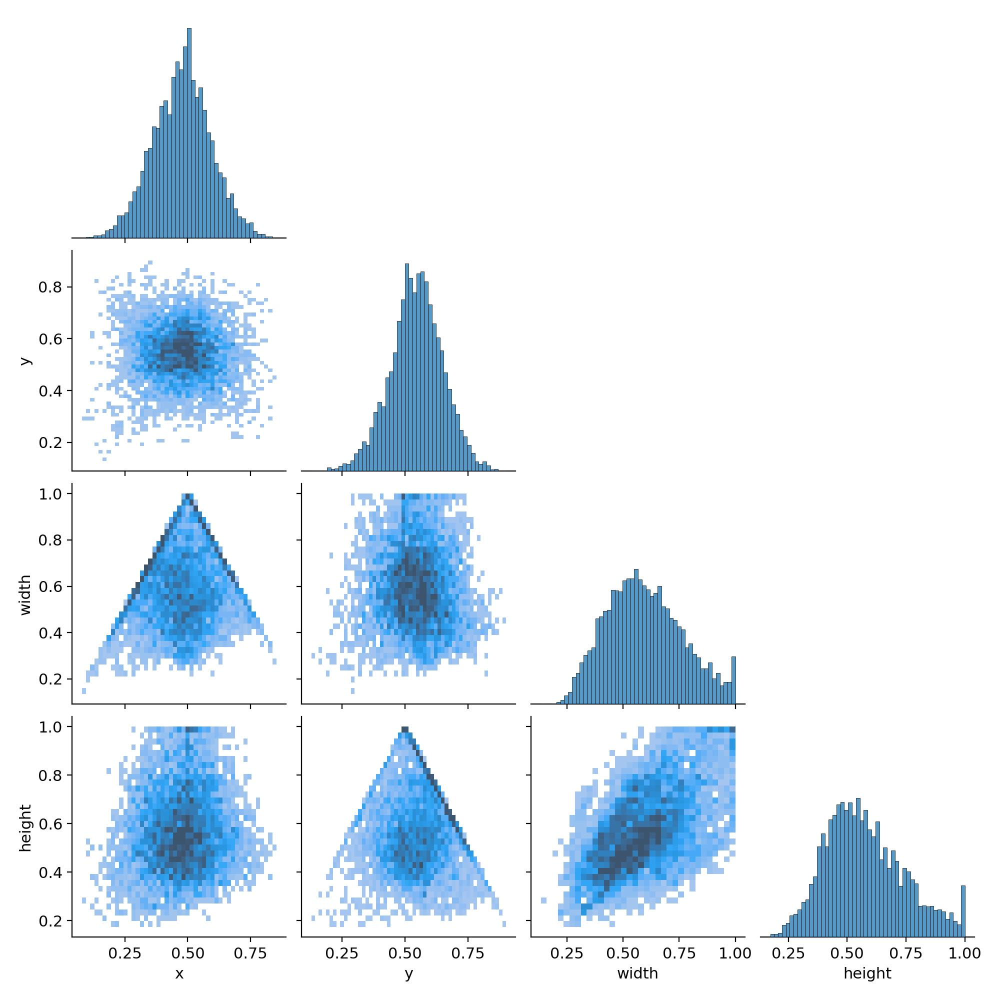
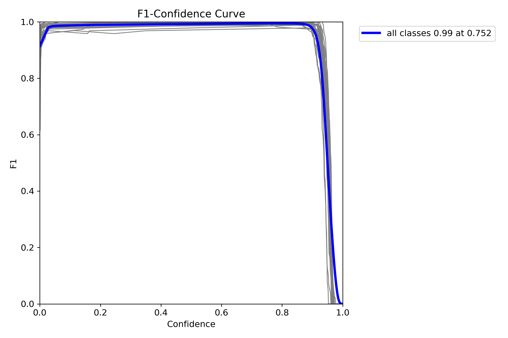
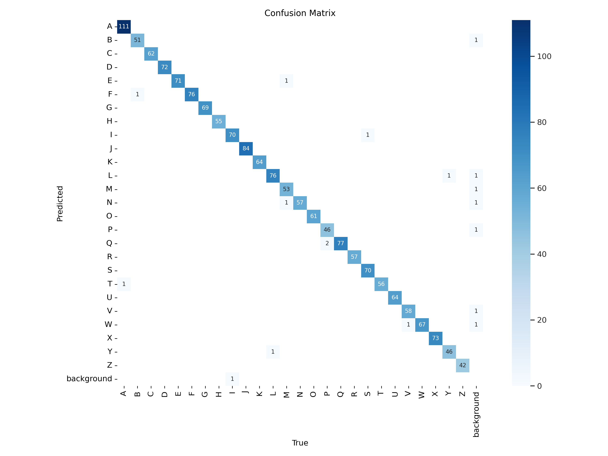
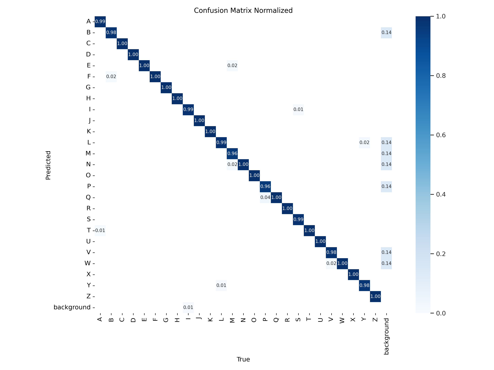

# Sign Language Detector

## Table of Contents
- [Project Overview](#project-overview)
- [Key Features](#key-features)
- [System Architecture](#system-architecture)
- [Installation](#installation)
- [Usage](#usage)
- [Hardware Setup](#hardware-setup)
- [Model Training](#model-training)
- [Testing](#testing)
- [Contributing](#contributing)
- [License](#license)
- [Maintainers](#maintainers)
- [Citations and Acknowledgements](#citations-and-acknowledgements)

## Project Overview
A sign language detector application using computer vision and YOLO. Predicts letters in sign language captured from a webcam frame. Designed for Windows, Linux, and server purposes.

## Key Features
- Letter prediction using YOLO12m
- Webcam streaming (1920x1080)
- Friendly, simple user interface

## System Architecture
```
.
├── notebooks
│   └── ai_model_training.ipynb       # AI model training notebook
├── src
│   ├── ai_model_interface.py         # AI model wrapper
│   ├── detection_processor.py        # Filters/processes AI detections
│   ├── frame_pipeline.py             # Main processing workflow
│   ├── frame_processor.py            # Frame resizing/normalization
│   ├── main.py                       # Program execution code
│   ├── sign_language_detector.pt     # YOLO12m sign language detection model
│   ├── tracking_system.py            # Object tracking implementation
│   └── video_stream_manager.py       # Camera/stream input handling
├── test
│   └── test_ai.py                    # Detection test for AI model
stream manager
└── test_images
    ├── sign_language_test_1.jpg      # Sample mock test image
    ├── sign_language_test_2.jpg      # Sample mock test image
    ├── sign_language_test_3.jpg      # Sample mock test image
    ├── sign_language_test_4.jpg      # Sample mock test image
    ├── sign_language_test_5.jpg      # Sample mock test image
    ├── sign_language_test_6.jpg      # Sample mock test image
    ├── sign_language_test_7.jpg      # Sample mock test image
    ├── sign_language_test_8.jpg      # Sample mock test image 
    ├── sign_language_test_9.jpg      # Sample mock test image 
    └── sign_language_test_10.jpg     # Sample mock test image
```

## Installation

### Prerequisites
- Python 3.11.9
- PIP 25.0.1
- Windows 11 or Ubuntu 20.04
- Nvidia GPU (to use CUDA)
- Computer Webcam

```bash
# Clone repository
git clone https://github.com/alonsovazqueztena/sign_language_detection.git
cd sign_language_detection

# Create virtual environment
python -m venv env
source env/bin/activate      # Linux/MacOS
source env/Scripts/activate  # Windows

# Install dependencies
pip install -r requirements.txt
```

## Usage

### Basic Operation
```bash
# Execute the program using the source code (must be in src folder)
python main.py
```

#### Keyboard Control
| Key | Description            |
|-----|------------------------|
| q   | Quit camera            |


## Hardware Setup
**Camera Connection**
- **USB Webcam**: Plug into available USB port
- **IP Camera**: Set RTSP URL
- **Computer Webcam**: Use the computer's own webcam

## Model Training
### General Steps
1. The Junyper notebook used to train the YOLO12m model is found within the notebooks folder.

```
.
├── notebooks
│   └── ai_model_training.ipynb       # AI model training notebook
```

2. Use **Google Colab** to ensure proper functionality and avoidance of dependency issues.

3. Ensure that CUDA is installed to allow for proper leveraging of the GPU if available.

```bash
# Ensure that CUDA is available to be used for faster, 
# optimized AI training.

!nvidia-smi

import torch

print("torch.cuda.is_available():", torch.cuda.is_available())
print("torch.cuda.device_count():", torch.cuda.device_count())
```

4. Replace the following file paths:

```bash
# Check if Google Drive is able to
# be accessed.
!ls Insert Google Drive path here
```

```bash
# If Google Drive is present, remove it
# to ensure we can mount it again.
!rm -rf Insert Google Drive path here
```

```bash
# We import the Google Drive again.
from google.colab import drive

# We mount the Google Drive.
drive.mount('Insert Google Drive path here')
```

```bash
# Check if we can access the images dataset.
!ls "Insert images dataset path here"
```

```bash
# Load and execute a live feed of the Tensorboard graphs.
%load_ext tensorboard
%tensorboard --logdir insert/directory/to/runs/here
```

```bash
# We take in the Tensorboard log directory.
tensorboard_log_dir = "Insert Tensorboard log directory path here"
```

```bash
# We load in the YOLO model here.
    model = YOLO(
        "Insert your YOLO model directory path here")
```

```bash
# We train for one epoch here.

    # We bring in the data through a YAML file, establish
    # the image size, assign what device we will save (GPU CUDA),
    # enable automatic saving, save every epoch, set the TensorBoard
    # log directory, and log each run separately.
    train_results = model.train(
        data="Insert your image dataset YAML file path here",
        epochs=100, imgsz=640, device="cuda", save=True, save_period=1,
        project=tensorboard_log_dir, name=f"session(insert-number)"
        )
```

5. Execute each cell from top to bottom, one at a time.

6. To check live results of the AI model training, examine the Tensorboard server run in this cell:
```bash
# Load and execute a live feed of the Tensorboard graphs.
%load_ext tensorboard
%tensorboard --logdir insert/directory/to/runs/here
```

### Expected Results
- **Tensorboard logs directory**: Every run will be its own subdirectory. In it, the following will be contained:

  1. Weights folder (every epoch weight, last weight, best weight)

  2. Validation batches (predictions and labels)

  3. Train batches

  4. Metric results (Graphs and CSV): box loss (train and validation), cls loss (train and validation), dfl loss (train and validation), precision (B), recall (B), mAP50 (B), and mAP50-95 (B)

  5. Curve graphs: Precision, recall,  precision-recall, and F1

  6. Label graphs (regular and correlogram)

  7. Confusion matrix graphs (regular and normalized)

  8. Training arguments YAML file

### Sign Language AI Model Results
The following results were achieved with the final YOLO12m model used for this project:

- **Metric results:**



- **R curve:**



- **PR curve:**



- **P curve:**



- **Labels graphs:**


- **Labels correlogram:**



- **F1 curve:**



- **Confusion matrix:**



- **Confusion matrix (normalized):**



## Testing
### Module Testing

To test the following modules:
- **Video Stream Manager**
- **Frame Processor**
- **AI Model Interface**
- **Detection Processor**
- **Tracking System**
- **Frame Pipeline**

Run:

```bash
# Ensure you are in the correct directory.

cd src

# Run all main module tests of the program.

python main.py
```

### AI Model Testing
1. The AI testing script is found within the test folder:

```
.
├── test
│   └── test_ai.py                    # Detection test for AI model
```

2. Update this filepath to your test image filepath:
```bash
results = model.predict(
    "insert_test_image_filepath_here", conf=0.5, 
    imgsz=640, show=True, save=True, project="..\\runs")
```

3. To test the AI model, run:

```bash
# Ensure you are in the correct directory.

cd test

# Run a sign language detection test on an image (must be in JPG format).

python test_ai.py   # Results in runs folder
```

4. A runs folder will be created or used if present. Within it, a predict folder will be created for every prediction made on an image. The image will have the AI predictions labelled:
```
.
└── runs
    └── predict 
        └── processed_test_image.jpg  # Detection test for AI model
```

## Contributing

1. Fork the repository
2. Create a feature branch:
```bash
git checkout -b feature/new-tracker
```
3. Add tests for new functionality
4. Submit a pull request

### Coding Standards
- PEP8 compliance
- Docstrings for all modules
- 80%+ test coverage

## License
MIT License - See LICENSE for details

## Maintainers
- Alonso Vazquez Tena  
- Daniel Saravia  
- Jason Broom

## Citations and Acknowledgements
**YOLO12**  
```bibtex
@article{tian2025yolov12,
  title={YOLOv12: Attention-Centric Real-Time Object Detectors},
  author={Tian, Yunjie and Ye, Qixiang and Doermann, David},
  journal={arXiv preprint arXiv:2502.12524},
  year={2025}
}

@software{yolo12,
  author = {Tian, Yunjie and Ye, Qixiang and Doermann, David},
  title = {YOLOv12: Attention-Centric Real-Time Object Detectors},
  year = {2025},
  url = {https://github.com/sunsmarterjie/yolov12},
  license = {AGPL-3.0}
}
```

**Image Dataset**
```bibtex
@misc{asl-alphabet-recognition_dataset,
  title = { ASL Alphabet Recognition Dataset },
  type = { Open Source Dataset },
  author = { University of Central Florida },
  howpublished = { \url{ https://universe.roboflow.com/university-of-central-florida/asl-alphabet-recognition } },
  url = { https://universe.roboflow.com/university-of-central-florida/asl-alphabet-recognition },
  journal = { Roboflow Universe },
  publisher = { Roboflow },
  year = { 2023 },
  month = { aug },
  note = { visited on 2025-03-30 },
}
```

**Main Source Code**

This project was adapted from Alonso Vazquez Tena and Daniel Saravia's AIegis Beam capstone project: https://github.com/alonsovazqueztena/Mini_C-RAM_Capstone.
