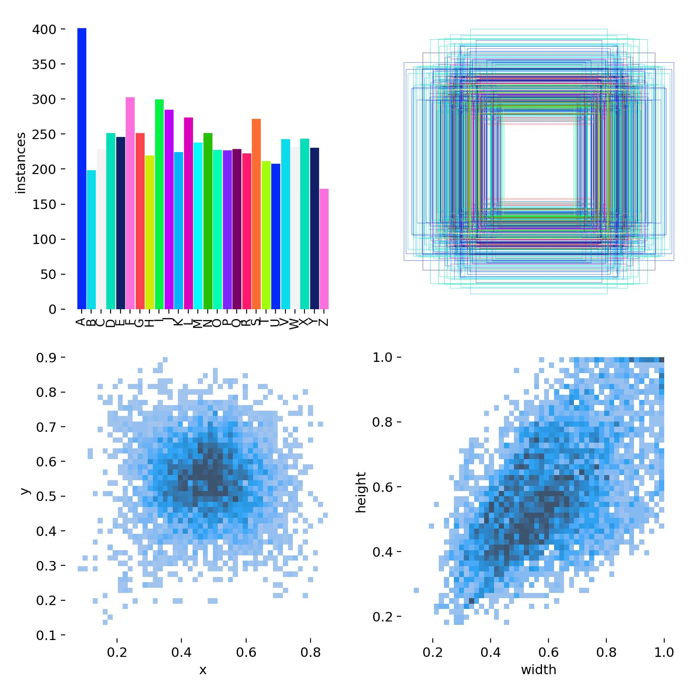

# Sign Language Detector

## Table of Contents
- [Project Overview](#project-overview)
- [Key Features](#key-features)
- [System Architecture](#system-architecture)
- [Installation](#installation)
- [Usage](#usage)
- [Hardware Setup](#hardware-setup)
- [Model Training](#model-training)
- [Testing](#testing)
- [Troubleshooting](#troubleshooting)
- [Contributing](#contributing)
- [License](#license)
- [Maintainers](#maintainers)
- [Citations and Acknowledgements](#citations-and-acknowledgements)

## Project Overview
A sign language detector application using computer vision and YOLO. Predicts letters in sign language captured from a webcam frame. Designed for Windows, Linux, and server purposes.

## Key Features
- Letter prediction using YOLO12m
- Webcam streaming
- Friendly, simple user interface

## System Architecture
```
.
├── notebooks
│   └── ai_model_training.ipynb       # AI model training notebook
├── src
│   ├── ai_model_interface.py         # AI model wrapper
│   ├── frame_pipeline.py             # Main processing workflow
│   ├── main.py                       # Program execution code
│   ├── sign_language_detector.pt     # YOLO12m sign language detection model
│   ├── tracking_system.py            # Object tracking implementation
│   └── video_stream_manager.py       # Camera/stream input handling
├── test
│   └── test_ai.py                    # Detection test for AI model
stream manager
└── test_images
    ├── sign_language_test_1.jpg      # Sample mock test image
    ├── sign_language_test_2.jpg      # Sample mock test image
    ├── sign_language_test_3.jpg      # Sample mock test image
    ├── sign_language_test_4.jpg      # Sample mock test image
    ├── sign_language_test_5.jpg      # Sample mock test image
    ├── sign_language_test_6.jpg      # Sample mock test image
    ├── sign_language_test_7.jpg      # Sample mock test image
    ├── sign_language_test_8.jpg      # Sample mock test image 
    ├── sign_language_test_9.jpg      # Sample mock test image 
    └── sign_language_test_10.jpg     # Sample mock test image
```

## Installation

### Prerequisites
- Python 3.11.9
- PIP 25.0.1
- Windows 11 or Ubuntu 20.04
- Computer Webcam, USB Webcam or IP Camera

Follow these steps to ensure the program can be executed:
```bash
# Clone repository
git clone https://github.com/alonsovazqueztena/sign_language_detection.git
cd sign_language_detection

# Create virtual environment
python -m venv env
source env/bin/activate      # Linux/MacOS
source env/Scripts/activate  # Windows

# Install dependencies
pip install -r requirements.txt
```

## Usage

### Basic Operation
To execute the sign language detection and tracking software, run this:
```bash
# Execute the program using the source code (must be in src folder)
python main.py
python3 main.py # Or also this.
```

### User Control
For keyboard control, follow these commands: 
| Key | Description            |
|-----|------------------------|
| q   | Quit program           |


## Hardware Setup
**Camera Connection**

To set up a USB phone webcam, do the following:

1. Install Iriun Webcam (can be for either Android or iPhone) for both the computer and the phone.
2. Setup and ensure Iriun Webcam is running on both the phone and computer.
3. Plug a USB cable into the phone and computer.
4. Ensure that Iriun Webcam is receiving your video frame.

## Model Training
### General Steps
1. The Junyper notebook used to train the YOLO12m model is found within the notebooks folder.

```
.
├── notebooks
│   └── ai_model_training.ipynb       # AI model training notebook
```

2. Use **Google Colab** to ensure proper functionality and avoidance of dependency issues.

3. Ensure that CUDA is installed to allow for proper leveraging of the GPU if available.

```bash
!nvidia-smi # Check Nvidia GPU.
import torch # Use GPU for AI training.
print("torch.cuda.is_available():", torch.cuda.is_available())
print("torch.cuda.device_count():", torch.cuda.device_count()) 
```

4. Replace the following file paths:

```bash
!ls Insert Google Drive path here # Check drive access.
```

```bash
!rm -rf Insert Google Drive path here # Remove to ensure mounting.
```

```bash
from google.colab import drive # Import drive again.
drive.mount('Insert Google Drive path here') # Mount drive.
```

```bash
!ls "Insert images dataset path here" # Check image dataset access.
```

```bash
%load_ext tensorboard # Load Tensorboard.
%tensorboard --logdir insert/directory/to/runs/here # Execute Tensorboard.
```

```bash
tensorboard_log_dir = "Insert Tensorboard log directory path here" # Tensorboard log directory.
```

```bash
model = YOLO("Insert your YOLO model directory path here") # Load YOLO model.
```

```bash
train_results = model.train(
        data="Insert your image dataset YAML file path here",
        epochs=100, imgsz=640, device="cuda", save=True, save_period=10,
        project=tensorboard_log_dir, name=f"session(insert-name)"
        ) # Train YOLO model (YAML file, epochs, image size, GPU or CPU, allowed saving, save period, log, run name).
```

5. Execute each cell from top to bottom, one at a time.

6. To check live results of the AI model training, examine the Tensorboard server run in this cell:
```bash
%load_ext tensorboard # Load Tensorboard.
%tensorboard --logdir insert/directory/to/runs/here # Execute Tensorboard.
```

### Expected Results
- **Tensorboard logs directory**: Every run will be its own subdirectory. In it, the following will be contained:

  1. Weights folder (every epoch weight, last weight, best weight)

  2. Validation batches (predictions and labels)

  3. Train batches

  4. Metric results (Graphs and CSV): box loss (train and validation), cls loss (train and validation), dfl loss (train and validation), precision (B), recall (B), mAP50 (B), and mAP50-95 (B)

  5. Curve graphs: Precision, recall,  precision-recall, and F1

  6. Label graphs (regular and correlogram)

  7. Confusion matrix graphs (regular and normalized)

  8. Training arguments YAML file

### Sign Language AI Model Results
The following results were achieved with the final YOLO12m model used for this project:

- **Metric Graphs:**


- **Recall-Confidence Curve:**


- **Precision-Recall Curve:**


- **Precision-Confidence Curve:**


- **Label Graphs:**



- **Label Correlogram:**


- **F1 Curve:**


- **Confusion Matrix:**


- **Confusion Matrix (Normalized):**


## Testing
### Module Testing

To test the following modules:
- **Video Stream Manager**
- **AI Model Interface**
- **Tracking System**
- **Frame Pipeline**

Run:

```bash
cd src # Ensure you are in the correct directory.
python main.py # Run all main module tests of the program.
```

### AI Model Testing
1. The AI testing script is found within the test folder:

```
.
├── test
│   └── test_ai.py                    # Detection test for AI model
```

2. Update this filepath to your test image filepath:
```bash
results = model.predict("..\\test_images\sign_language_test_1.jpg", conf=0.5, imgsz=640, show=True, save=True) # Run inference (confidence, image size, display, save prediction).
```

3. To test the AI model, run:

```bash
cd test # Ensure you are in the correct directory.

# Run a sign language detection test on an image (must be in JPG format).
python test_ai.py   # Results in runs folder
```

4. A runs folder will be created or used if present. Within it, a predict folder will be created for every prediction made on an image. The image will have the AI predictions labelled:
```
.
└── runs
    └── predict 
        └── processed_test_image.jpg  # Detection test for AI model
```

## Troubleshooting
### ERROR: No frames available.
Ensure that all the capture device indexes match to your capture device (0 if its an internal webcam, 1 if its an external webcam such as an Iriun webcam or GoPro).

video_stream_manager.py:
```bash
def __init__(self, capture_device=0, max_queue_size=10): # Update the capture device index.
```

## Contributing

1. Fork the repository
2. Create a feature branch:
```bash
git checkout -b feature/new-tracker
```
3. Add tests for new functionality
4. Submit a pull request

### Coding Standards
- Complete concise commenting
- Docstrings for all modules
- 80%+ test coverage

## License
MIT License - See LICENSE for details

## Maintainers
- Alonso Vazquez Tena: AI Engineer
- Daniel Saravia: Cloud Engineer
- Jason Broom: Front-End Developer

## Citations and Acknowledgements
**YOLO12**  
```bibtex
@article{tian2025yolov12,
  title={YOLOv12: Attention-Centric Real-Time Object Detectors},
  author={Tian, Yunjie and Ye, Qixiang and Doermann, David},
  journal={arXiv preprint arXiv:2502.12524},
  year={2025}
}

@software{yolo12,
  author = {Tian, Yunjie and Ye, Qixiang and Doermann, David},
  title = {YOLOv12: Attention-Centric Real-Time Object Detectors},
  year = {2025},
  url = {https://github.com/sunsmarterjie/yolov12},
  license = {AGPL-3.0}
}
```

**Image Dataset**
```bibtex
@misc{asl-alphabet-recognition_dataset,
  title = { ASL Alphabet Recognition Dataset },
  type = { Open Source Dataset },
  author = { University of Central Florida },
  howpublished = { \url{ https://universe.roboflow.com/university-of-central-florida/asl-alphabet-recognition } },
  url = { https://universe.roboflow.com/university-of-central-florida/asl-alphabet-recognition },
  journal = { Roboflow Universe },
  publisher = { Roboflow },
  year = { 2023 },
  month = { aug },
  note = { visited on 2025-03-30 },
}
```

**Main Source Code**

This project was adapted from Alonso Vazquez Tena and Daniel Saravia's AIegis Beam capstone project: https://github.com/alonsovazqueztena/Mini_C-RAM_Capstone.
